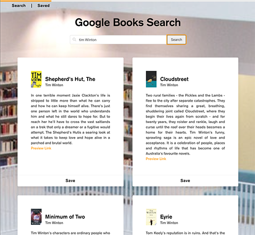
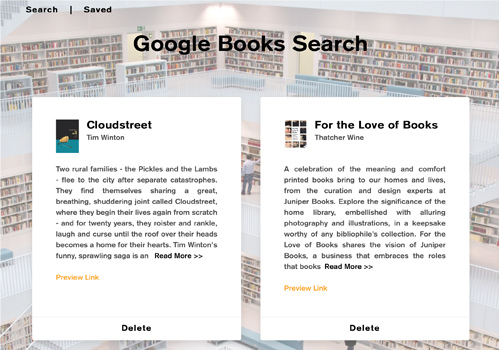

# Google Books Search

## Description

An application to search for books and dave the ones you want to read.

Deployed app :link:

Github repository :link: https://github.com/avpizarro/googlebookssearchreact.git

## Table of Contents

- [Installation](#installation)
- [Usage](#usage)
- [License](#license)
- [Questions](#questions)

## Installation

Visit this link to start using the app :link: 

## Usage

Search for a book using any term and ten results will display. You can click save to add a book to your list. Visit the Saved page to see your book shelf and remove any book.

## License

This Source Code Form is subject to the terms of the MIT License.
If a copy of the License was not distributed with this file, You can obtain one at https://opensource.org/licenses

## Questions

For further information please visit my GitHub page:
https://github.com/avpizarro

Or email me directly :e-mail: avpizarro@live.com
